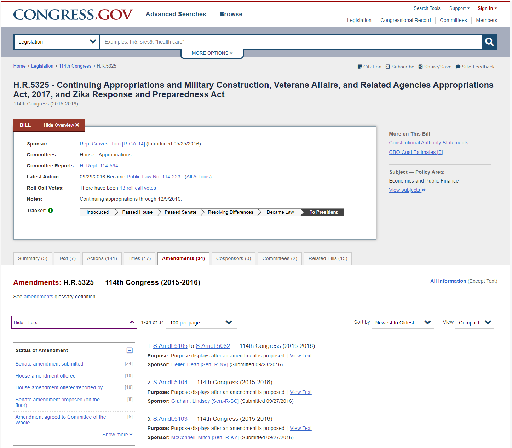
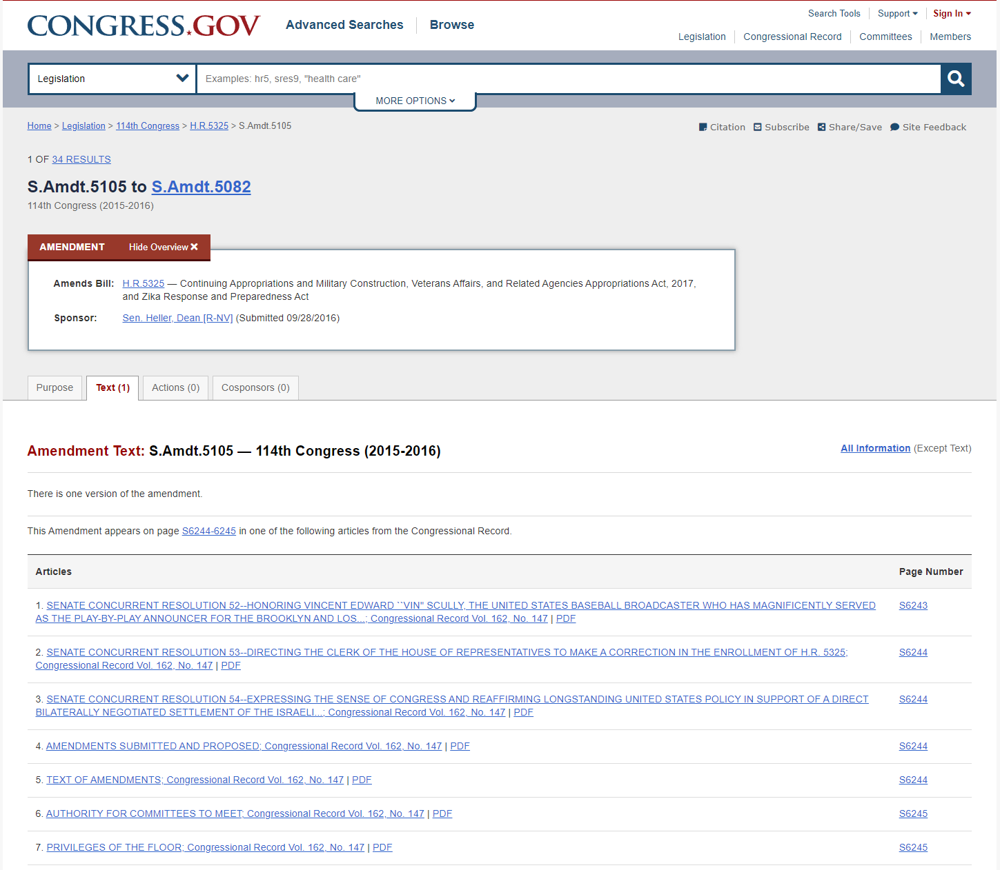
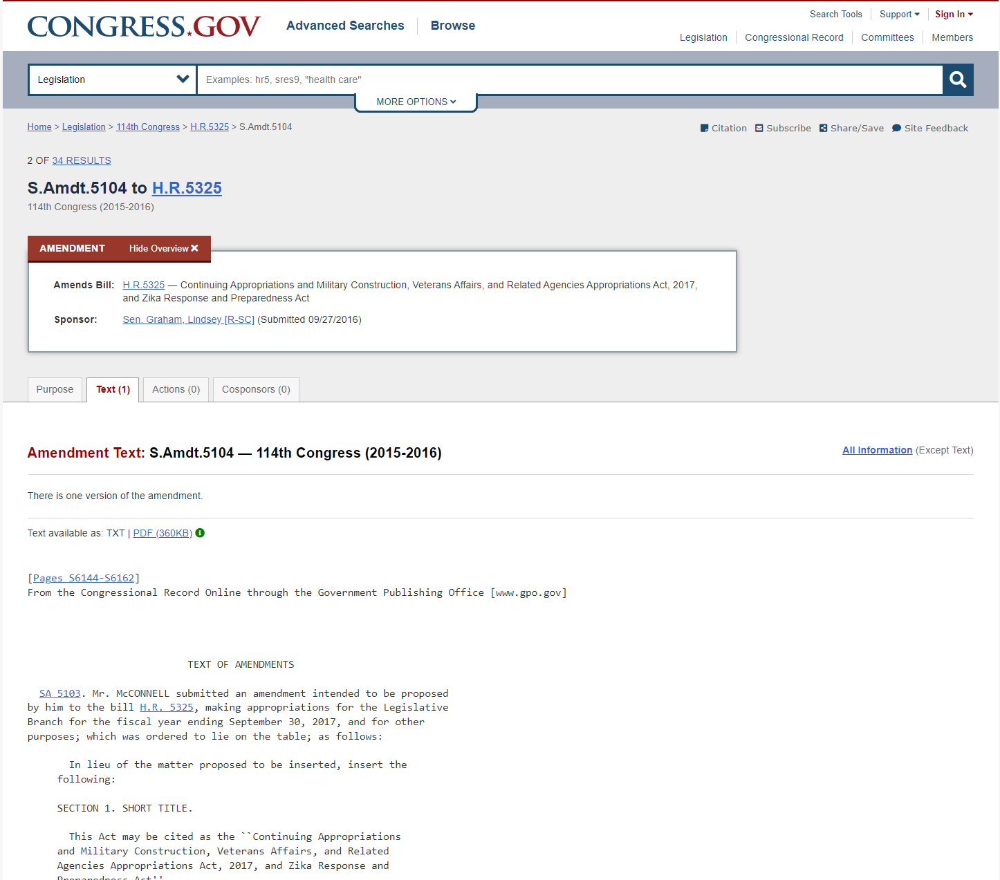

# Amendments Scraping
This folder contains all the relevant code used for amendment scraping. 

The main script is `scrape.py`, which calls the classes and the class methods defined in `scrape_amendments.py` and `scrape_amendments_text.py`. To run the code, you need to have `selenium` (with a ChromeDriver), `beautifulsoup`, and other typical data science packages installed. 

Steps:
1. Construct the `amendments.txt` manually according to "Instructions for Appropriations/Amendment Data Collection". The key index page on congress.gov is [this](https://crsreports.congress.gov/AppropriationsStatusTable)
2. Copy and paste some rows from `amendments.txt` to `amendments_to_run.txt` This will be the list of amendments to scrape in the next step. Since scraping all amendments will take a while, it is recommended to scrape parts of the entire list at one time. 
3. Run `scrape.py`. Make sure you have the correct version of the Chrome Driver matching with Chrome on your computer. You can check the Chrome version on your computer by going to `chrome://version/`. Download appropriate version of Chrome [here](https://chromedriver.chromium.org/downloads). 
4. The scraping will run automatically. The code is written to be rather fault-tolerant, but in some rare circumstances you will need to handle unexpected exceptions. 
5. The scraped text files will be saved in `output` and in a folder with the name of bill (e.g. H.R.4567). That folder will contain all the amendments in `amendment_text_X.Amdt.XXX.txt`, and an index file `amdt_text_index.csv` that contains metadata for all the amendments. Sometimes the metadata in `amdt_text_index.csv` are malformed, and in that case you can use [Congress.gov API](https://api.congress.gov/) to recover the relevant metadata. 

Appendix:
This script is capable of scraping amendment texts of the following format:
  
  
  
